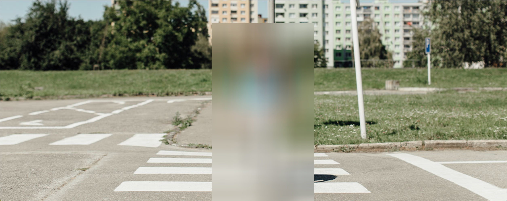

# hafdh-nadhar

Package Python that blur human representations from an image


### Installation

```sh
pdm install --dev
```

### Test-it

```sh
pdm run python tests/example.py
```

### Build and publish

```sh
pdm publish --password <API_TOKEN>
```

### Exemple

Before:


After:

